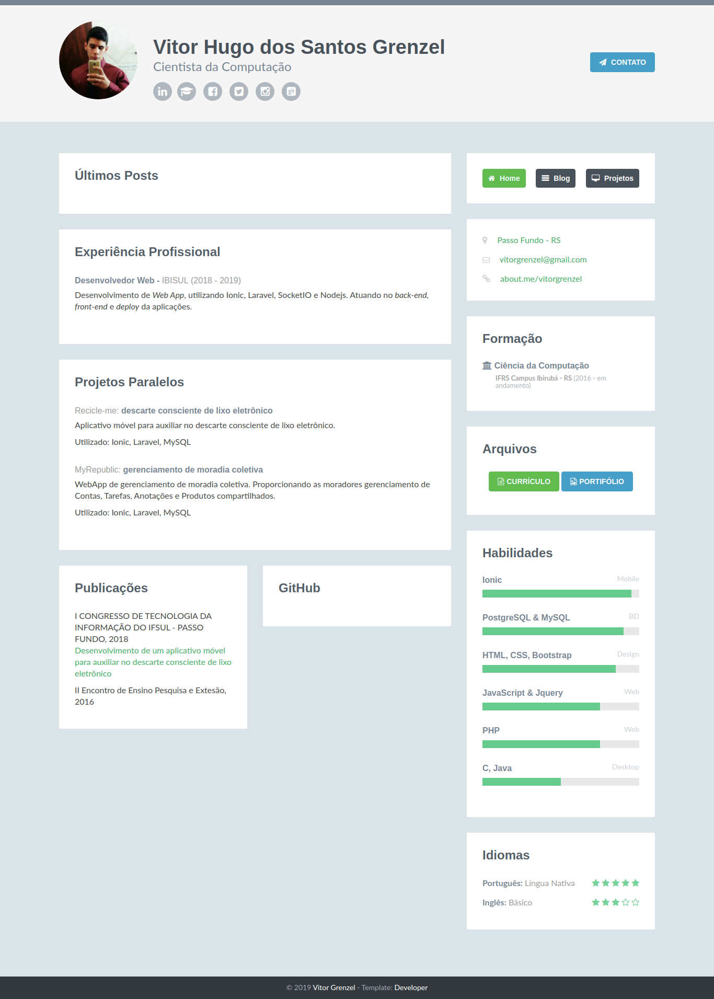

<h1 align="center">
	<!--  -->
  My portfolio v1
</h1>

  <a href="#-about-the-project">About the project</a>&nbsp;&nbsp;&nbsp;|&nbsp;&nbsp;&nbsp;
  <a href="#-technologies">Technologies</a>&nbsp;&nbsp;&nbsp;|&nbsp;&nbsp;&nbsp;
  <a href="#-technologies">Printscreen</a>

## 👨🏻‍💻 About the project

My Personal Page, My personal page on digital curriculum format. Based on the theme [Developer](http://themes.3rdwavemedia.com/website-templates/free-responsive-website-template-for-developers/)

## 🚀 Technologies

Technologies that I used to develop this mobile client

	 
	

## 📷 Printscreen

